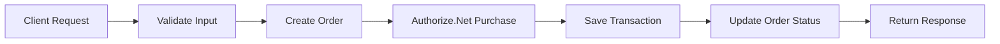
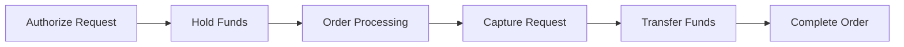
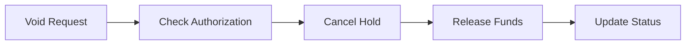
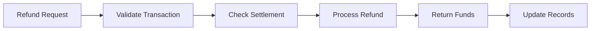
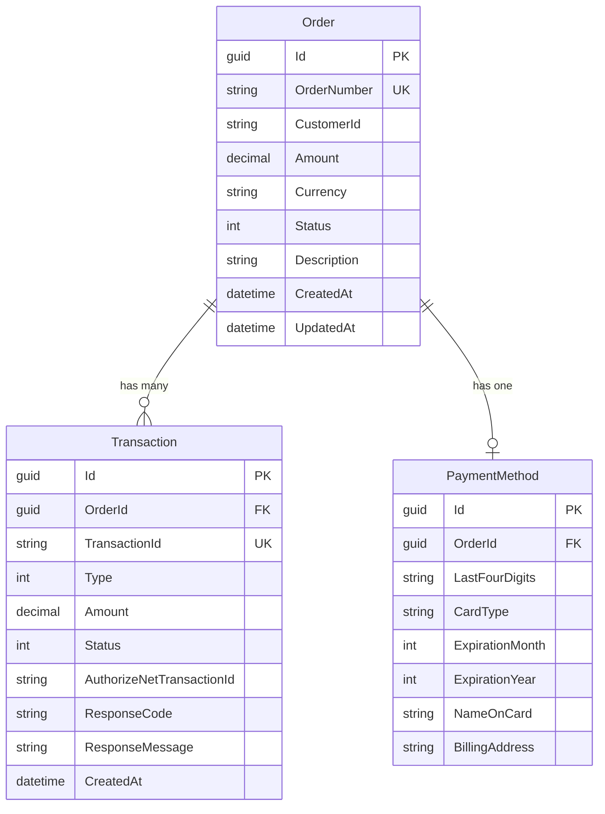

# Payment Processing System - Architecture Overview

## 🏛️ **System Architecture**

The Payment Processing System is built using **ASP.NET Core 9.0** with **Clean Architecture** principles, integrating with **Authorize.Net** for payment processing and **SQL Server** for data persistence.

### **Technology Stack**
- **Framework**: ASP.NET Core 9.0 Web API
- **Database**: SQL Server / LocalDB with Entity Framework Core
- **Payment Gateway**: Authorize.Net SDK (v2.0.4)
- **Authentication**: JWT Bearer Tokens
- **Documentation**: Swagger/OpenAPI
- **Testing**: xUnit with Moq

---

## 🔌 **API Endpoints Overview**

### **Base URL**: `https://localhost:7001/api`

### **Authentication Endpoints**

| Method | Endpoint | Description | Auth Required |
|--------|----------|-------------|---------------|
| `POST` | `/auth/login` | Generate JWT token for API access | ❌ |

### **Payment Processing Endpoints**

| Method | Endpoint | Description | Auth Required |
|--------|----------|-------------|---------------|
| `POST` | `/payments/purchase` | Direct purchase (authorize + capture) | ✅ |
| `POST` | `/payments/authorize` | Authorize payment (hold funds) | ✅ |
| `POST` | `/payments/capture/{transactionId}` | Capture authorized payment | ✅ |
| `POST` | `/payments/void/{transactionId}` | Void/cancel authorization | ✅ |
| `POST` | `/payments/refund/{transactionId}` | Process full or partial refund | ✅ |

### **Order Management Endpoints**

| Method | Endpoint | Description | Auth Required |
|--------|----------|-------------|---------------|
| `GET` | `/orders/{orderId}` | Get order details with transactions | ✅ |
| `GET` | `/orders` | List orders with pagination | ✅ |
| `GET` | `/orders/{orderId}/transactions` | Get all transactions for an order | ✅ |

### **Diagnostic Endpoints**

| Method | Endpoint | Description | Auth Required |
|--------|----------|-------------|---------------|
| `GET` | `/diagnostics/config-test` | Test Authorize.Net configuration | ✅ |
| `GET` | `/diagnostics/database-test` | Test database connectivity | ✅ |
| `GET` | `/diagnostics/transaction-refund-check/{transactionId}` | Check refund eligibility | ✅ |

---

## 🔄 **Payment Flows Implemented**

### **1. Direct Purchase Flow**
**Endpoint**: `POST /api/payments/purchase`



**Use Case**: Single-step payment processing (most common)
- Authorizes and captures payment in one operation
- Immediate fund transfer
- Best for digital products and services

### **2. Authorize + Capture Flow**
**Endpoints**: 
- `POST /api/payments/authorize` (Step 1)
- `POST /api/payments/capture/{transactionId}` (Step 2)



**Use Case**: Two-step payment processing
- Step 1: Authorize (hold funds on customer's card)
- Step 2: Capture (transfer funds to merchant)
- Best for physical products requiring fulfillment

### **3. Void Flow**
**Endpoint**: `POST /api/payments/void/{transactionId}`



**Use Case**: Cancel authorization before capture
- Releases held funds back to customer
- Only works on unsettled transactions
- No fees for voided authorizations

### **4. Refund Flow**
**Endpoint**: `POST /api/payments/refund/{transactionId}`



**Use Case**: Return money to customer
- Full or partial refunds supported
- Requires settled transactions (24+ hours)
- Includes original payment method details

---

## 🗄️ **Database Schema & Entity Relationships**

### **Entity Relationship Diagram**



### **Table Definitions**

#### **Orders Table**
```sql
CREATE TABLE Orders (
    Id UNIQUEIDENTIFIER PRIMARY KEY DEFAULT NEWID(),
    OrderNumber NVARCHAR(50) NOT NULL UNIQUE,
    CustomerId NVARCHAR(100) NOT NULL,
    Amount DECIMAL(18,2) NOT NULL,
    Currency NVARCHAR(3) NOT NULL DEFAULT 'USD',
    Status INT NOT NULL,
    Description NVARCHAR(500) NULL,
    CreatedAt DATETIME2 NOT NULL DEFAULT GETUTCDATE(),
    UpdatedAt DATETIME2 NOT NULL DEFAULT GETUTCDATE()
);
```

**Order Status Enum Values:**
- `0` - Pending
- `1` - Authorized
- `2` - Captured
- `3` - Voided
- `4` - Refunded
- `5` - Failed

#### **Transactions Table**
```sql
CREATE TABLE Transactions (
    Id UNIQUEIDENTIFIER PRIMARY KEY DEFAULT NEWID(),
    OrderId UNIQUEIDENTIFIER NOT NULL,
    TransactionId NVARCHAR(100) NOT NULL UNIQUE,
    Type INT NOT NULL,
    Amount DECIMAL(18,2) NOT NULL,
    Status INT NOT NULL,
    AuthorizeNetTransactionId NVARCHAR(50) NULL,
    ResponseCode NVARCHAR(10) NULL,
    ResponseMessage NVARCHAR(500) NULL,
    CreatedAt DATETIME2 NOT NULL DEFAULT GETUTCDATE(),
    FOREIGN KEY (OrderId) REFERENCES Orders(Id) ON DELETE CASCADE
);
```

**Transaction Type Enum Values:**
- `0` - Purchase
- `1` - Authorize
- `2` - Capture
- `3` - Void
- `4` - Refund

**Transaction Status Enum Values:**
- `0` - Pending
- `1` - Success
- `2` - Failed
- `3` - Cancelled

#### **PaymentMethods Table**
```sql
CREATE TABLE PaymentMethods (
    Id UNIQUEIDENTIFIER PRIMARY KEY DEFAULT NEWID(),
    OrderId UNIQUEIDENTIFIER NOT NULL,
    LastFourDigits NVARCHAR(4) NOT NULL,
    CardType NVARCHAR(20) NULL,
    ExpirationMonth INT NOT NULL,
    ExpirationYear INT NOT NULL,
    NameOnCard NVARCHAR(100) NULL,
    BillingAddress NVARCHAR(500) NULL,
    FOREIGN KEY (OrderId) REFERENCES Orders(Id) ON DELETE CASCADE
);
```

### **Key Relationships**

1. **Order → Transactions** (One-to-Many)
   - Each order can have multiple transactions (authorize, capture, refund, etc.)
   - Cascade delete: Deleting an order removes all related transactions

2. **Order → PaymentMethod** (One-to-One)
   - Each order has one payment method
   - Stores only last 4 digits for PCI compliance

3. **Transaction → Order** (Many-to-One)
   - Each transaction belongs to exactly one order
   - Foreign key relationship with cascade delete

---

## 📋 **Postman Collection Structure**

### **Collection Organization**

```
Payment Processing API
├── 🔐 Authentication
│   └── POST Login
├── 💳 Payment Operations
│   ├── POST Purchase
│   ├── POST Authorize
│   ├── POST Capture
│   ├── POST Void
│   └── POST Refund
├── 📋 Order Management
│   ├── GET Order Details
│   ├── GET Orders List
│   └── GET Order Transactions
└── 🔧 Diagnostics
    ├── GET Config Test
    ├── GET Database Test
    └── GET Refund Check
```

### **Environment Variables**

```json
{
  "baseUrl": "https://localhost:7001/api",
  "jwtToken": "{{auth_token}}",
  "orderId": "{{order_id}}",
  "transactionId": "{{transaction_id}}"
}
```

### **Sample Requests**

#### **1. Authentication**
```http
POST {{baseUrl}}/auth/login
Content-Type: application/json

{
  "username": "admin",
  "password": "password"
}
```

#### **2. Purchase Payment**
```http
POST {{baseUrl}}/payments/purchase
Authorization: Bearer {{jwtToken}}
Content-Type: application/json

{
  "customerId": "CUST_12345",
  "amount": 100.50,
  "description": "Product purchase",
  "creditCard": {
    "cardNumber": "4111111111111111",
    "expirationMonth": 12,
    "expirationYear": 2025,
    "cvv": "123",
    "nameOnCard": "John Doe"
  }
}
```

#### **3. Authorize Payment**
```http
POST {{baseUrl}}/payments/authorize
Authorization: Bearer {{jwtToken}}
Content-Type: application/json

{
  "customerId": "CUST_12345",
  "amount": 200.00,
  "description": "Pre-authorization",
  "creditCard": {
    "cardNumber": "4111111111111111",
    "expirationMonth": 12,
    "expirationYear": 2025,
    "cvv": "123",
    "nameOnCard": "John Doe"
  }
}
```

#### **4. Capture Payment**
```http
POST {{baseUrl}}/payments/capture/{{transactionId}}
Authorization: Bearer {{jwtToken}}
Content-Type: application/json

{
  "amount": 200.00
}
```

#### **5. Void Payment**
```http
POST {{baseUrl}}/payments/void/{{transactionId}}
Authorization: Bearer {{jwtToken}}
```

#### **6. Refund Payment**
```http
POST {{baseUrl}}/payments/refund/{{transactionId}}
Authorization: Bearer {{jwtToken}}
Content-Type: application/json

{
  "amount": 50.25,
  "reason": "Customer requested refund"
}
```

#### **7. Get Order Details**
```http
GET {{baseUrl}}/orders/{{orderId}}
Authorization: Bearer {{jwtToken}}
```

#### **8. List Orders**
```http
GET {{baseUrl}}/orders?page=1&pageSize=10
Authorization: Bearer {{jwtToken}}
```

---

## 🔒 **Security Architecture**

### **Authentication Flow**
1. Client sends credentials to `/auth/login`
2. Server validates credentials (hardcoded: admin/password)
3. Server generates JWT token with 60-minute expiration
4. Client includes token in `Authorization: Bearer {token}` header
5. Server validates token on each protected endpoint

### **Data Security**
- **PCI Compliance**: No full credit card numbers stored
- **Encryption**: JWT tokens signed with secure secret key
- **HTTPS**: All communications encrypted in transit
- **Input Validation**: All inputs validated at API level

---

## 🚀 **Deployment Architecture**

### **Development Environment**
- **Database**: LocalDB (automatic creation)
- **URLs**: `https://localhost:7001`, `http://localhost:5000`
- **Swagger**: Available at root URL for testing

### **Production Environment**
- **Database**: SQL Server with proper connection pooling
- **Security**: Environment-based configuration
- **Monitoring**: Application Insights integration
- **Scaling**: Horizontal scaling support

---

## 📊 **Performance Considerations**

### **Database Optimization**
- **Indexes**: Created on frequently queried fields (CustomerId, OrderId, CreatedAt)
- **Connection Pooling**: EF Core connection pooling enabled
- **Async Operations**: All database operations are asynchronous

### **API Performance**
- **Caching**: Response caching for read operations
- **Pagination**: Large result sets paginated
- **Compression**: Response compression enabled

---

## 🔄 **Integration Points**

### **Authorize.Net Integration**
- **SDK Version**: 2.0.4 (compatible with .NET 9)
- **Environment**: Sandbox for testing, Production for live
- **Error Handling**: Comprehensive error mapping and user-friendly messages

### **Database Integration**
- **ORM**: Entity Framework Core 9.0
- **Migrations**: Code-first approach with automatic migrations
- **Relationships**: Properly configured foreign keys and cascade deletes

---

This architecture provides a robust, scalable foundation for payment processing with clear separation of concerns, comprehensive error handling, and production-ready security features.
