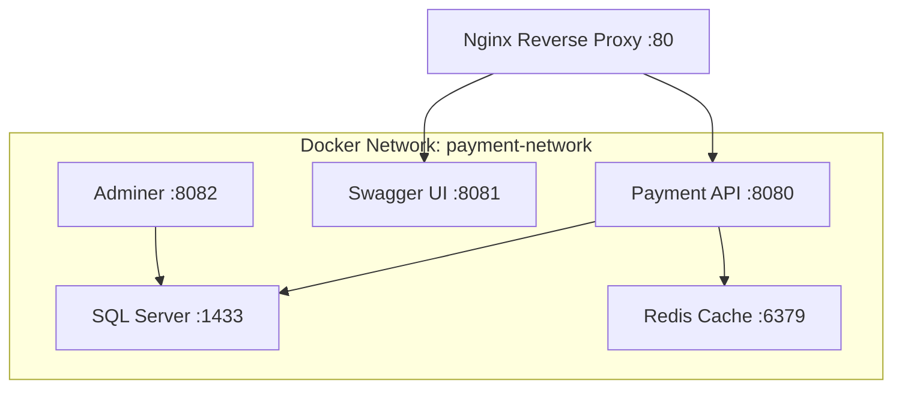

# Payment Processing System - Docker Deployment Guide

## 🐳 **Docker Compose Overview**

This Docker Compose setup provides a complete, production-ready payment processing system with all required components for easy validation and testing.

### **🏗️ Architecture Components**



## 📦 **Services Included**

| Service | Container Name | Port | Purpose | Health Check |
|---------|---------------|------|---------|--------------|
| **nginx** | payment-nginx | 80, 443 | Reverse proxy, load balancer, SSL termination | ✅ |
| **payment-api** | payment-api | 8080 | Main ASP.NET Core Web API | ✅ |
| **sqlserver** | payment-sqlserver | 1433 | SQL Server 2022 Express database | ✅ |
| **swagger-ui** | payment-swagger-ui | 8081 | Interactive API documentation | ✅ |
| **redis** | payment-redis | 6379 | Redis cache for future scaling | ✅ |
| **adminer** | payment-adminer | 8082 | Database administration tool | ✅ |

## 🚀 **Quick Start**

### **Prerequisites**
- Docker Desktop 4.0+ installed
- Docker Compose v2.0+ (included with Docker Desktop)
- 4GB+ available RAM
- 10GB+ available disk space

### **Option 1: Automated Setup (Recommended)**

#### **Windows:**
```cmd
# Run the automated setup script
docker-setup.bat

# Or with specific commands:
docker-setup.bat start    # Start services only
docker-setup.bat stop     # Stop services
docker-setup.bat restart  # Restart services
docker-setup.bat health   # Health check
docker-setup.bat clean    # Clean up resources
```

#### **Linux/macOS:**
```bash
# Make script executable
chmod +x docker-setup.sh

# Run the automated setup script
./docker-setup.sh

# Or with specific commands:
./docker-setup.sh start    # Start services only
./docker-setup.sh stop     # Stop services
./docker-setup.sh restart  # Restart services
./docker-setup.sh health   # Health check
./docker-setup.sh clean    # Clean up resources
```

### **Option 2: Manual Setup**

#### **1. Configure Environment**
```bash
# Copy and edit environment variables
cp .env.example .env
# Edit .env with your Authorize.Net credentials
```

#### **2. Build and Start Services**
```bash
# Build all images
docker-compose build

# Start all services
docker-compose up -d

# View logs
docker-compose logs -f
```

#### **3. Verify Services**
```bash
# Check service status
docker-compose ps

# Test API health
curl http://localhost:8080/api/diagnostics/database-test
```

## ⚙️ **Configuration**

### **Environment Variables (.env)**

```env
# Database Configuration
SA_PASSWORD=PaymentDB123!
DB_NAME=PaymentProcessingDB

# API Configuration
ASPNETCORE_ENVIRONMENT=Production
API_PORT=8080

# Authorize.Net Configuration (REQUIRED - Update with your credentials)
AUTHORIZENET_API_LOGIN_ID=your-sandbox-api-login-id
AUTHORIZENET_TRANSACTION_KEY=your-16-char-key

# JWT Configuration
JWT_SECRET_KEY=your-very-secure-jwt-secret-key-at-least-32-characters-long
JWT_ISSUER=PaymentProcessingAPI
JWT_AUDIENCE=PaymentProcessingClients
JWT_EXPIRATION_MINUTES=60

# Service Ports
NGINX_PORT=80
SWAGGER_PORT=8081
ADMINER_PORT=8082
REDIS_PORT=6379
```

### **⚠️ Important Configuration Notes**

1. **Authorize.Net Credentials**: Update `AUTHORIZENET_API_LOGIN_ID` and `AUTHORIZENET_TRANSACTION_KEY` with your sandbox credentials
2. **JWT Secret**: Change `JWT_SECRET_KEY` to a secure, random string (minimum 32 characters)
3. **Database Password**: Change `SA_PASSWORD` for production deployments
4. **Ports**: Ensure ports 80, 1433, 6379, 8080, 8081, 8082 are available

## 🔌 **Service Access**

### **Primary Endpoints**
- **🌐 Main Application**: http://localhost
- **🔌 Payment API**: http://localhost:8080/api
- **📚 Swagger UI**: http://localhost/swagger/
- **🗄️ Database Admin**: http://localhost:8082
- **📊 Redis**: localhost:6379

### **API Authentication**
```bash
# Get JWT token
curl -X POST http://localhost/api/auth/login \
  -H "Content-Type: application/json" \
  -d '{"username":"admin","password":"password"}'

# Use token in subsequent requests
curl -X GET http://localhost/api/orders \
  -H "Authorization: Bearer YOUR_JWT_TOKEN"
```

## 🧪 **Testing the System**

### **1. Health Checks**
```bash
# API health
curl http://localhost:8080/api/diagnostics/database-test

# Database health
curl http://localhost:8080/api/diagnostics/config-test

# All services status
docker-compose ps
```

### **2. Complete Payment Flow Test**
```bash
# 1. Get authentication token
TOKEN=$(curl -s -X POST http://localhost/api/auth/login \
  -H "Content-Type: application/json" \
  -d '{"username":"admin","password":"password"}' | \
  jq -r '.token')

# 2. Make a test purchase
curl -X POST http://localhost/api/payments/purchase \
  -H "Content-Type: application/json" \
  -H "Authorization: Bearer $TOKEN" \
  -d '{
    "customerId": "TEST_CUSTOMER_001",
    "amount": 10.00,
    "description": "Docker test purchase",
    "creditCard": {
      "cardNumber": "4111111111111111",
      "expirationMonth": 12,
      "expirationYear": 2025,
      "cvv": "123",
      "nameOnCard": "Test User"
    }
  }'

# 3. List orders
curl -X GET http://localhost/api/orders \
  -H "Authorization: Bearer $TOKEN"
```

### **3. Database Validation**
```bash
# Access database via Adminer
# 1. Go to http://localhost:8082
# 2. Login with:
#    System: SQL Server
#    Server: sqlserver
#    Username: sa
#    Password: PaymentDB123!
#    Database: PaymentProcessingDB
```

## 📊 **Monitoring & Logs**

### **View Logs**
```bash
# All services
docker-compose logs -f

# Specific service
docker-compose logs -f payment-api
docker-compose logs -f sqlserver
docker-compose logs -f nginx

# Last 100 lines
docker-compose logs --tail=100 payment-api
```

### **Service Status**
```bash
# Check running containers
docker-compose ps

# Check resource usage
docker stats

# Check networks
docker network ls | grep payment
```

### **Health Monitoring**
```bash
# API health endpoint
curl http://localhost:8080/api/diagnostics/database-test

# Database connection test
docker-compose exec sqlserver /opt/mssql-tools/bin/sqlcmd \
  -S localhost -U sa -P PaymentDB123! -Q "SELECT 1"

# Redis connection test
docker-compose exec redis redis-cli ping
```

## 🔧 **Troubleshooting**

### **Common Issues**

#### **1. Port Conflicts**
```bash
# Check what's using port 80
netstat -tulpn | grep :80

# Use different ports in docker-compose.yml
ports:
  - "8000:80"  # Change from 80 to 8000
```

#### **2. SQL Server Startup Issues**
```bash
# Check SQL Server logs
docker-compose logs sqlserver

# Restart SQL Server
docker-compose restart sqlserver

# Check if database is accessible
docker-compose exec sqlserver /opt/mssql-tools/bin/sqlcmd \
  -S localhost -U sa -P PaymentDB123! -Q "SELECT @@VERSION"
```

#### **3. API Connection Issues**
```bash
# Check API logs
docker-compose logs payment-api

# Verify database connection string
docker-compose exec payment-api env | grep ConnectionStrings

# Test API directly
curl http://localhost:8080/api/diagnostics/config-test
```

#### **4. Memory Issues**
```bash
# Check Docker resource usage
docker stats

# Increase Docker Desktop memory allocation
# Docker Desktop -> Settings -> Resources -> Memory (recommend 4GB+)
```

### **Reset Everything**
```bash
# Stop and remove all containers, networks, and volumes
docker-compose down --volumes --remove-orphans

# Remove all images
docker-compose down --rmi all

# Clean up Docker system
docker system prune -a --volumes

# Restart from scratch
docker-compose up -d --build
```

## 🔒 **Security Considerations**

### **Production Deployment**
1. **Change Default Passwords**: Update SA_PASSWORD and JWT_SECRET_KEY
2. **Use Secrets Management**: Store sensitive data in Docker secrets or external vault
3. **Enable HTTPS**: Configure SSL certificates in Nginx
4. **Network Security**: Use custom networks and restrict external access
5. **Update Images**: Regularly update base images for security patches

### **Secure Configuration Example**
```yaml
# docker-compose.prod.yml
services:
  payment-api:
    environment:
      - ConnectionStrings__DefaultConnection=${DB_CONNECTION_STRING}
      - AuthorizeNet__ApiLoginId=${AUTHNET_API_LOGIN}
      - AuthorizeNet__TransactionKey=${AUTHNET_TRANSACTION_KEY}
      - Jwt__SecretKey=${JWT_SECRET}
    secrets:
      - db_password
      - jwt_secret
      - authnet_credentials

secrets:
  db_password:
    external: true
  jwt_secret:
    external: true
  authnet_credentials:
    external: true
```

## 📈 **Scaling & Performance**

### **Horizontal Scaling**
```yaml
# Scale API instances
services:
  payment-api:
    deploy:
      replicas: 3
    
  # Load balancer configuration
  nginx:
    depends_on:
      - payment-api
```

### **Performance Optimization**
```yaml
# Add resource limits
services:
  payment-api:
    deploy:
      resources:
        limits:
          cpus: '2.0'
          memory: 1G
        reservations:
          cpus: '1.0'
          memory: 512M
```

## 🚀 **Production Deployment**

### **Production Checklist**
- [ ] Update all default passwords
- [ ] Configure proper SSL certificates
- [ ] Set up external database (Azure SQL, AWS RDS)
- [ ] Configure external Redis cluster
- [ ] Set up monitoring and alerting
- [ ] Configure backup strategies
- [ ] Update Authorize.Net to production environment
- [ ] Set up log aggregation
- [ ] Configure auto-scaling policies
- [ ] Set up CI/CD pipeline

### **Cloud Deployment**
```bash
# Deploy to Azure Container Instances
az container create --resource-group myResourceGroup \
  --file docker-compose.yml

# Deploy to AWS ECS
ecs-cli compose up --cluster-config my-cluster

# Deploy to Google Cloud Run
gcloud run services replace docker-compose.yml
```

---

## 📋 **Quick Reference**

### **Essential Commands**
```bash
# Start system
docker-compose up -d

# Stop system
docker-compose down

# View logs
docker-compose logs -f

# Restart service
docker-compose restart payment-api

# Scale service
docker-compose up -d --scale payment-api=3

# Update and restart
docker-compose pull && docker-compose up -d

# Backup database
docker-compose exec sqlserver /opt/mssql-tools/bin/sqlcmd \
  -S localhost -U sa -P PaymentDB123! \
  -Q "BACKUP DATABASE PaymentProcessingDB TO DISK='/tmp/backup.bak'"
```

### **Service URLs Quick Access**
- Main App: http://localhost
- API: http://localhost:8080/api
- Swagger: http://localhost/swagger/
- DB Admin: http://localhost:8082
- Health: http://localhost:8080/api/diagnostics/database-test

**Your payment processing system is now fully containerized and ready for development, testing, and production deployment!** 🚀🐳
