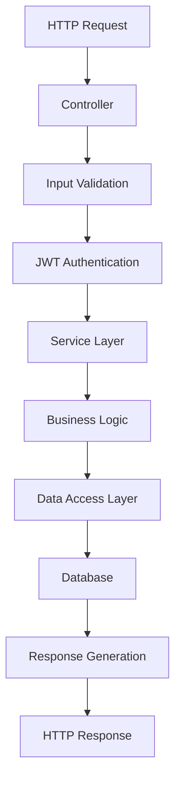

# Payment Processing System - Project Structure

## 🏗️ **Architecture Overview**

The Payment Processing System follows **Clean Architecture** principles with clear separation of concerns, dependency inversion, and maintainable code structure. The system is built using **ASP.NET Core 9.0** with a layered architecture approach.

### **Architectural Principles**

- ✅ **Clean Architecture**: Clear separation between business logic, data access, and presentation layers
- ✅ **Dependency Injection**: All services are registered and injected through the DI container
- ✅ **SOLID Principles**: Single responsibility, open/closed, dependency inversion
- ✅ **Repository Pattern**: Abstracted data access through Entity Framework Core
- ✅ **Service Layer Pattern**: Business logic encapsulated in service classes
- ✅ **DTO Pattern**: Data transfer objects for API communication

---

## 📁 **Solution Structure**

```
Payment_Processing_System/
├── 📄 Payment_Processing_System.sln          # Visual Studio Solution File
├── 📄 README.md                              # Comprehensive project documentation
├── 📄 TECHNICAL_DESIGN.md                    # Technical architecture document
├── 📄 API_EXAMPLES.md                        # Complete API usage examples
├── 📄 PROJECT_STRUCTURE.md                   # This document
├── 📂 PaymentProcessingWebAPI/               # Main Web API Project
└── 📂 PaymentProcessingWebAPI.Tests/         # Unit Test Project
```

### **Solution File Details**

| File | Purpose | Description |
|------|---------|-------------|
| `Payment_Processing_System.sln` | **Solution Container** | Visual Studio solution file containing both main API and test projects |
| `README.md` | **Project Documentation** | Comprehensive setup, configuration, and usage guide |
| `TECHNICAL_DESIGN.md` | **Architecture Documentation** | Detailed technical design, database schema, and API specifications |
| `API_EXAMPLES.md` | **Usage Examples** | Complete request/response examples for all endpoints |

---

## 🚀 **Main API Project Structure**

### **PaymentProcessingWebAPI/** - *Core Web API Application*

```
PaymentProcessingWebAPI/
├── 📄 Program.cs                             # Application entry point & configuration
├── 📄 PaymentProcessingWebAPI.csproj         # Project file with dependencies
├── 📄 appsettings.json                       # Application configuration
├── 📄 appsettings.Development.json           # Development-specific settings
├── 📄 PaymentProcessingWebAPI.http           # HTTP request examples
├── 📂 Controllers/                           # API Controllers (Presentation Layer)
├── 📂 Services/                              # Business Logic Layer
├── 📂 Models/                                # Data Models & DTOs
├── 📂 Data/                                  # Data Access Layer
├── 📂 Configuration/                         # Configuration Models
├── 📂 Properties/                            # Launch settings
├── 📂 bin/                                   # Compiled binaries (auto-generated)
└── 📂 obj/                                   # Build artifacts (auto-generated)
```

---

## 🎮 **Controllers Layer** - *API Presentation Layer*

**Location**: `PaymentProcessingWebAPI/Controllers/`

The Controllers layer handles HTTP requests, validates input, and orchestrates business operations through services.

### **Controller Files**

| Controller | Purpose | Endpoints | Responsibilities |
|------------|---------|-----------|------------------|
| **`AuthController.cs`** | **Authentication** | `POST /api/auth/login` | • JWT token generation<br/>• User authentication<br/>• Security validation |
| **`PaymentsController.cs`** | **Payment Processing** | `POST /api/payments/*` | • Purchase transactions<br/>• Authorization & capture<br/>• Void & refund operations<br/>• Payment validation |
| **`OrdersController.cs`** | **Order Management** | `GET /api/orders/*` | • Order retrieval<br/>• Order history<br/>• Transaction listing<br/>• Pagination support |
| **`DiagnosticsController.cs`** | **System Diagnostics** | `GET /api/diagnostics/*` | • Configuration testing<br/>• Database connectivity<br/>• Health checks<br/>• Troubleshooting |

### **Controller Architecture Features**

- ✅ **JWT Authentication**: All payment endpoints secured with Bearer tokens
- ✅ **Input Validation**: Comprehensive validation using Data Annotations
- ✅ **Swagger Documentation**: XML comments for interactive API docs
- ✅ **Error Handling**: Consistent error responses with proper HTTP status codes
- ✅ **Async Operations**: All operations are asynchronous for better performance

---

## 🔧 **Services Layer** - *Business Logic Layer*

**Location**: `PaymentProcessingWebAPI/Services/`

The Services layer contains the core business logic, separated into interfaces and implementations following the Dependency Inversion principle.

### **Service Architecture**

```
Services/
├── 📂 Interfaces/                            # Service Contracts
│   ├── 📄 IPaymentService.cs                # Payment processing contract
│   ├── 📄 IOrderService.cs                  # Order management contract
│   ├── 📄 ITransactionService.cs            # Transaction handling contract
│   └── 📄 IJwtService.cs                    # Authentication contract
└── 📂 Implementations/                       # Service Implementations
    ├── 📄 PaymentService.cs                 # Core payment logic
    ├── 📄 OrderService.cs                   # Order business logic
    ├── 📄 TransactionService.cs             # Transaction operations
    └── 📄 JwtService.cs                     # JWT token management
```

### **Service Responsibilities**

#### **`IPaymentService` / `PaymentService`** - *Core Payment Engine*
- **Purpose**: Handles all payment operations with Authorize.Net
- **Key Methods**:
  - `PurchaseAsync()` - Direct purchase (auth + capture)
  - `AuthorizeAsync()` - Authorization only (hold funds)
  - `CaptureAsync()` - Capture previously authorized payment
  - `VoidAsync()` - Cancel authorization before capture
  - `RefundAsync()` - Process full or partial refunds
- **Dependencies**: Authorize.Net SDK, Database Context, Configuration
- **Features**: Error handling, transaction validation, payment method security

#### **`IOrderService` / `OrderService`** - *Order Management*
- **Purpose**: Manages order lifecycle and data operations
- **Key Methods**:
  - `CreateOrderAsync()` - Create new orders with validation
  - `GetOrderAsync()` - Retrieve order by ID
  - `GetOrdersAsync()` - Paginated order listing
  - `UpdateOrderStatusAsync()` - Order status management
- **Dependencies**: Database Context, Entity Framework
- **Features**: Order number generation, status tracking, audit trail

#### **`ITransactionService` / `TransactionService`** - *Transaction Operations*
- **Purpose**: Handles transaction records and history
- **Key Methods**:
  - `CreateTransactionAsync()` - Create transaction records
  - `UpdateTransactionAsync()` - Update transaction status
  - `GetTransactionAsync()` - Retrieve transaction details
  - `GetOrderTransactionsAsync()` - Get all transactions for an order
- **Dependencies**: Database Context, Entity Framework
- **Features**: Transaction ID generation, status tracking, relationship management

#### **`IJwtService` / `JwtService`** - *Authentication & Security*
- **Purpose**: JWT token generation and validation
- **Key Methods**:
  - `GenerateToken()` - Create JWT tokens with claims
  - `ValidateToken()` - Token validation and parsing
- **Dependencies**: JWT Configuration, Security libraries
- **Features**: Token expiration, role-based claims, secure key management

---

## 📊 **Models Layer** - *Data Structures*

**Location**: `PaymentProcessingWebAPI/Models/`

The Models layer defines data structures for both database entities and API communication.

### **Model Architecture**

```
Models/
├── 📂 Entities/                              # Database Entities (Domain Models)
│   ├── 📄 Order.cs                          # Order entity with relationships
│   ├── 📄 Transaction.cs                    # Transaction entity with enums
│   └── 📄 PaymentMethod.cs                  # Payment method entity (secure)
└── 📂 DTOs/                                 # Data Transfer Objects (API Models)
    ├── 📄 PaymentRequest.cs                 # Payment request models
    └── 📄 PaymentResponse.cs                # Payment response models
```

### **Entity Details**

#### **`Order.cs`** - *Core Order Entity*
- **Purpose**: Represents customer orders in the database
- **Key Properties**:
  - `Id` (Guid) - Primary key
  - `OrderNumber` (string) - Human-readable order identifier
  - `CustomerId` (string) - Customer reference
  - `Amount` (decimal) - Order total amount
  - `Currency` (string) - Currency code (USD)
  - `Status` (OrderStatus enum) - Order lifecycle status
  - `Transactions` (List) - Related transactions
- **Relationships**: One-to-Many with Transactions and PaymentMethods
- **Features**: Audit timestamps, status tracking, cascade operations

#### **`Transaction.cs`** - *Payment Transaction Entity*
- **Purpose**: Represents individual payment operations
- **Key Properties**:
  - `Id` (Guid) - Primary key
  - `TransactionId` (string) - Internal transaction identifier
  - `Type` (TransactionType enum) - Purchase, Authorize, Capture, Void, Refund
  - `Amount` (decimal) - Transaction amount
  - `Status` (TransactionStatus enum) - Success, Failed, Pending
  - `AuthorizeNetTransactionId` (string) - Authorize.Net reference
- **Enums**: `TransactionType`, `TransactionStatus`
- **Features**: Authorize.Net integration, response tracking, audit trail

#### **`PaymentMethod.cs`** - *Secure Payment Information*
- **Purpose**: Stores payment method details securely
- **Key Properties**:
  - `LastFourDigits` (string) - Last 4 digits only (PCI compliance)
  - `ExpirationMonth/Year` (int) - Card expiration
  - `CardType` (string) - Visa, Mastercard, etc.
- **Security**: No full card numbers stored, PCI DSS compliant

### **DTO Details**

#### **`PaymentRequest.cs`** - *API Request Models*
- **Models**: `PaymentRequest`, `CreditCardDto`, `CaptureRequest`, `RefundRequest`
- **Purpose**: Validate and structure incoming API requests
- **Features**: Data annotations, validation attributes, Swagger examples

#### **`PaymentResponse.cs`** - *API Response Models*
- **Models**: `PaymentResponse`, `OrderResponse`, `TransactionResponse`
- **Purpose**: Structure API responses consistently
- **Features**: Success/error indicators, detailed information, standardized format

---

## 🗄️ **Data Layer** - *Database Access*

**Location**: `PaymentProcessingWebAPI/Data/`

### **`PaymentDbContext.cs`** - *Entity Framework Context*
- **Purpose**: Database context for Entity Framework Core operations
- **Features**:
  - **DbSets**: Orders, Transactions, PaymentMethods
  - **Relationships**: Configured entity relationships and constraints
  - **Conventions**: Automatic timestamp updates, cascade deletes
  - **Database Provider**: SQL Server with LocalDB support
- **Configuration**: Connection strings, entity configurations, indexing

### **Database Schema**

```sql
-- Orders Table
CREATE TABLE Orders (
    Id UNIQUEIDENTIFIER PRIMARY KEY,
    OrderNumber NVARCHAR(50) NOT NULL,
    CustomerId NVARCHAR(100) NOT NULL,
    Amount DECIMAL(18,2) NOT NULL,
    Currency NVARCHAR(3) NOT NULL DEFAULT 'USD',
    Status INT NOT NULL,
    Description NVARCHAR(500),
    CreatedAt DATETIME2 NOT NULL,
    UpdatedAt DATETIME2 NOT NULL
);

-- Transactions Table
CREATE TABLE Transactions (
    Id UNIQUEIDENTIFIER PRIMARY KEY,
    OrderId UNIQUEIDENTIFIER NOT NULL,
    TransactionId NVARCHAR(100) NOT NULL,
    Type INT NOT NULL,
    Amount DECIMAL(18,2) NOT NULL,
    Status INT NOT NULL,
    AuthorizeNetTransactionId NVARCHAR(50),
    ResponseCode NVARCHAR(10),
    ResponseMessage NVARCHAR(500),
    CreatedAt DATETIME2 NOT NULL,
    UpdatedAt DATETIME2 NOT NULL,
    FOREIGN KEY (OrderId) REFERENCES Orders(Id)
);

-- PaymentMethods Table
CREATE TABLE PaymentMethods (
    Id UNIQUEIDENTIFIER PRIMARY KEY,
    OrderId UNIQUEIDENTIFIER NOT NULL,
    LastFourDigits NVARCHAR(4) NOT NULL,
    ExpirationMonth INT NOT NULL,
    ExpirationYear INT NOT NULL,
    CardType NVARCHAR(20),
    CreatedAt DATETIME2 NOT NULL,
    FOREIGN KEY (OrderId) REFERENCES Orders(Id)
);
```

---

## ⚙️ **Configuration Layer** - *Application Settings*

**Location**: `PaymentProcessingWebAPI/Configuration/`

### **Configuration Models**

#### **`AuthorizeNetSettings.cs`** - *Payment Gateway Configuration*
- **Purpose**: Strongly-typed configuration for Authorize.Net integration
- **Properties**:
  - `Environment` (string) - "Sandbox" or "Production"
  - `ApiLoginId` (string) - Authorize.Net API Login ID
  - `TransactionKey` (string) - Authorize.Net Transaction Key (16 chars)
- **Usage**: Injected into PaymentService for API calls

#### **`JwtSettings.cs`** - *Authentication Configuration*
- **Purpose**: JWT token configuration and security settings
- **Properties**:
  - `SecretKey` (string) - JWT signing key (minimum 32 characters)
  - `Issuer` (string) - Token issuer identifier
  - `Audience` (string) - Token audience identifier
  - `ExpirationMinutes` (int) - Token lifetime (default: 60 minutes)
- **Usage**: Injected into JwtService and authentication middleware

### **Configuration Files**

#### **`appsettings.json`** - *Main Configuration*
```json
{
  "ConnectionStrings": {
    "DefaultConnection": "Data Source=(localdb)\\MSSQLLocalDB;Initial Catalog=PaymentProcessingDB;Integrated Security=true;TrustServerCertificate=true;"
  },
  "AuthorizeNet": {
    "Environment": "Sandbox",
    "ApiLoginId": "your-api-login-id",
    "TransactionKey": "your-16-char-key"
  },
  "Jwt": {
    "SecretKey": "your-secure-jwt-secret-key",
    "Issuer": "PaymentProcessingAPI",
    "Audience": "PaymentProcessingClients",
    "ExpirationMinutes": 60
  }
}
```

#### **`appsettings.Development.json`** - *Development Overrides*
- **Purpose**: Development-specific configuration overrides
- **Features**: Enhanced logging, development URLs, debug settings

---

## 🧪 **Test Project Structure**

### **PaymentProcessingWebAPI.Tests/** - *Unit Test Suite*

```
PaymentProcessingWebAPI.Tests/
├── 📄 PaymentProcessingWebAPI.Tests.csproj  # Test project configuration
├── 📂 Services/                             # Service layer tests
│   ├── 📄 OrderServiceTests.cs             # Order service unit tests
│   ├── 📄 TransactionServiceTests.cs       # Transaction service tests
│   └── 📄 JwtServiceTests.cs               # JWT service tests
├── 📂 TestResults/                          # Test execution results
├── 📂 bin/                                  # Test binaries
└── 📂 obj/                                  # Test build artifacts
```

### **Test Architecture**

#### **Testing Framework Stack**
- **xUnit**: Primary testing framework
- **Moq**: Mocking framework for dependencies
- **Entity Framework In-Memory**: In-memory database for testing
- **Coverlet**: Code coverage analysis

#### **Test Categories**

| Test Class | Purpose | Coverage |
|------------|---------|----------|
| **`OrderServiceTests`** | Order business logic validation | Order creation, updates, retrieval, pagination |
| **`TransactionServiceTests`** | Transaction operations testing | Transaction CRUD, ID generation, relationships |
| **`JwtServiceTests`** | Authentication security testing | Token generation, validation, expiration, roles |

#### **Test Features**
- ✅ **Isolated Tests**: Each test uses fresh in-memory database
- ✅ **Mocked Dependencies**: External dependencies mocked for unit isolation
- ✅ **Comprehensive Coverage**: ≥60% code coverage targeting business logic
- ✅ **Async Testing**: All async operations properly tested
- ✅ **Edge Cases**: Error conditions and boundary cases covered

---

## 📦 **Dependencies & NuGet Packages**

### **Main API Project Dependencies**

| Package | Version | Purpose | Category |
|---------|---------|---------|----------|
| **Microsoft.AspNetCore.OpenApi** | 9.0.6 | OpenAPI/Swagger support | Documentation |
| **Microsoft.EntityFrameworkCore.SqlServer** | 9.0.6 | SQL Server database provider | Data Access |
| **Microsoft.EntityFrameworkCore.Tools** | 9.0.6 | EF Core CLI tools | Development |
| **Microsoft.AspNetCore.Authentication.JwtBearer** | 9.0.6 | JWT authentication middleware | Security |
| **AuthorizeNet** | 2.0.4 | Authorize.Net payment gateway SDK | Payment Processing |
| **System.IdentityModel.Tokens.Jwt** | 8.1.2 | JWT token handling | Security |
| **Swashbuckle.AspNetCore** | 7.2.0 | Swagger UI and documentation | Documentation |

### **Test Project Dependencies**

| Package | Version | Purpose | Category |
|---------|---------|---------|----------|
| **Microsoft.NET.Test.Sdk** | Latest | .NET test SDK | Testing Framework |
| **xunit** | Latest | Unit testing framework | Testing Framework |
| **xunit.runner.visualstudio** | Latest | Visual Studio test runner | Testing Tools |
| **Moq** | Latest | Mocking framework | Testing Tools |
| **Microsoft.EntityFrameworkCore.InMemory** | 9.0.6 | In-memory database for testing | Testing Data |
| **Microsoft.Extensions.Options** | Latest | Configuration options for testing | Testing Configuration |
| **coverlet.collector** | Latest | Code coverage collection | Testing Analysis |

---

## 🔄 **Application Flow & Request Lifecycle**

### **Typical Request Flow**



### **Payment Processing Flow**

1. **Request Reception**: Controller receives HTTP request
2. **Authentication**: JWT token validation
3. **Input Validation**: Request model validation
4. **Service Orchestration**: Controller calls appropriate service
5. **Business Logic**: Service processes payment logic
6. **External API Call**: Authorize.Net SDK integration
7. **Data Persistence**: Database operations via Entity Framework
8. **Response Formation**: Structured response generation
9. **HTTP Response**: JSON response with status codes

---

## 🏗️ **Build & Deployment Structure**

### **Build Artifacts**

```
bin/                                          # Compiled Output
├── Debug/net9.0/                           # Debug build artifacts
└── Release/net9.0/                         # Release build artifacts

obj/                                          # Build Process Files
├── Debug/net9.0/                           # Debug build process
├── Release/net9.0/                         # Release build process
└── *.nuget.*                               # NuGet restore files
```

### **Key Build Files**

| File/Folder | Purpose | Description |
|-------------|---------|-------------|
| **`bin/Debug/net9.0/`** | Debug Binaries | Development build output with debug symbols |
| **`bin/Release/net9.0/`** | Release Binaries | Production-optimized build output |
| **`obj/`** | Build Artifacts | Temporary build files, caches, and metadata |
| **`*.csproj`** | Project Files | MSBuild project configuration and dependencies |

---

## 🔧 **Development Workflow**

### **Recommended Development Process**

1. **Code Changes**: Modify source files in appropriate layers
2. **Build**: `dotnet build` to compile and check for errors
3. **Test**: `dotnet test` to run unit tests and verify functionality
4. **Run**: `dotnet run` to start the development server
5. **Test API**: Use Swagger UI at `https://localhost:7001` for testing
6. **Debug**: Use diagnostic endpoints for troubleshooting

### **Layer Modification Guidelines**

| Layer | When to Modify | Impact |
|-------|----------------|--------|
| **Controllers** | Adding new endpoints, changing API contracts | API consumers |
| **Services** | Business logic changes, new features | Core functionality |
| **Models** | Database schema changes, new entities | Database migration required |
| **Configuration** | Settings changes, new integrations | Application restart required |

---

## 📋 **Best Practices & Conventions**

### **Code Organization**
- ✅ **Namespace Alignment**: Namespaces match folder structure
- ✅ **Single Responsibility**: Each class has a single, well-defined purpose
- ✅ **Interface Segregation**: Interfaces are focused and minimal
- ✅ **Dependency Injection**: All dependencies injected through constructor

### **Naming Conventions**
- ✅ **Controllers**: `{Entity}Controller` (e.g., `PaymentsController`)
- ✅ **Services**: `I{Entity}Service` / `{Entity}Service` (e.g., `IPaymentService`)
- ✅ **Entities**: Singular nouns (e.g., `Order`, `Transaction`)
- ✅ **DTOs**: Descriptive names with suffix (e.g., `PaymentRequest`)

### **Security Practices**
- ✅ **No Sensitive Data**: Credit card numbers never stored in full
- ✅ **JWT Security**: Secure key management and token expiration
- ✅ **Input Validation**: All inputs validated at controller level
- ✅ **Error Handling**: Sensitive information never exposed in errors

---

## 🎯 **Extension Points**

### **Adding New Features**

#### **New Payment Method**
1. Extend `PaymentService` with new method
2. Add corresponding controller endpoint
3. Create request/response DTOs
4. Add unit tests
5. Update Swagger documentation

#### **New Entity**
1. Create entity class in `Models/Entities/`
2. Add DbSet to `PaymentDbContext`
3. Create service interface and implementation
4. Add controller for API endpoints
5. Create corresponding tests

#### **New Integration**
1. Add configuration model in `Configuration/`
2. Register configuration in `Program.cs`
3. Create service for integration logic
4. Add dependency injection registration
5. Implement error handling and logging

---

This project structure provides a solid foundation for a scalable, maintainable payment processing system with clear separation of concerns and enterprise-grade architecture patterns.
