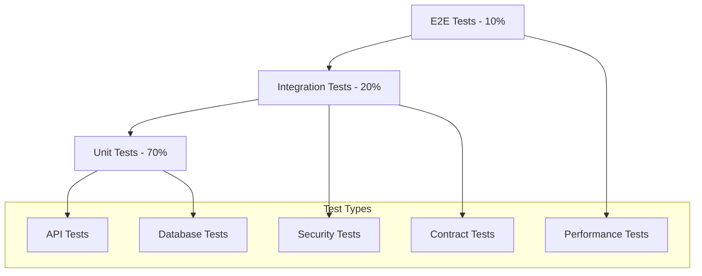
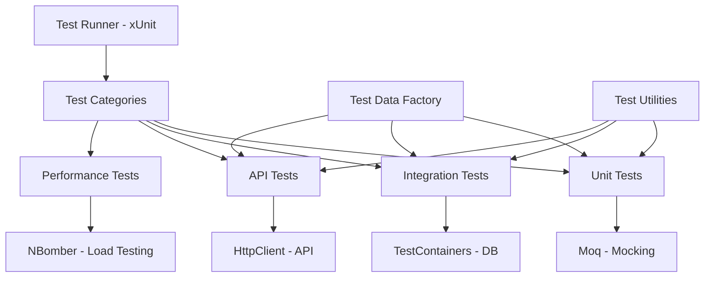

# Payment Processing System - Testing Strategy & Plan

## 🎯 **Testing Overview**

This document outlines a comprehensive testing strategy for the Payment Processing System, covering all aspects from unit tests to end-to-end validation. The strategy ensures robust, secure, and reliable payment processing with comprehensive coverage of business logic, security, and integration points.

### **Testing Objectives**
- ✅ **Functional Correctness**: Verify all payment flows work as expected
- ✅ **Security Validation**: Ensure secure handling of sensitive payment data
- ✅ **Performance Assurance**: Validate system performance under load
- ✅ **Integration Reliability**: Test external API integrations (Authorize.Net)
- ✅ **Error Handling**: Comprehensive error scenario coverage
- ✅ **Regression Prevention**: Automated tests to prevent future issues

---

## 🏗️ **Testing Pyramid Architecture**



### **Testing Distribution Strategy**
- **70% Unit Tests**: Fast, isolated, comprehensive business logic coverage
- **20% Integration Tests**: Service interactions, database operations, external APIs
- **10% End-to-End Tests**: Complete user workflows and critical business scenarios

---

## 🧪 **Unit Testing Strategy**

### **Coverage Targets**
- **Overall Coverage**: ≥80% line coverage
- **Business Logic**: ≥95% coverage for services and core logic
- **Controllers**: ≥70% coverage focusing on validation and flow
- **Critical Paths**: 100% coverage for payment processing flows

### **Unit Test Categories**

#### **1. Service Layer Tests**

##### **PaymentService Tests**
```csharp
public class PaymentServiceTests
{
    // Test Categories:
    // ✅ Purchase Flow Tests
    // ✅ Authorization Tests  
    // ✅ Capture Tests
    // ✅ Void Tests
    // ✅ Refund Tests
    // ✅ Error Handling Tests
    // ✅ Validation Tests
}
```

**Test Cases:**

| Test Case ID | Scenario | Expected Result | Priority |
|--------------|----------|-----------------|----------|
| **PS-001** | Valid purchase with test credit card | Success response with transaction ID | High |
| **PS-002** | Purchase with invalid credit card | Declined response with error message | High |
| **PS-003** | Purchase with insufficient funds | Declined response with specific error | High |
| **PS-004** | Authorization with valid card | Success with authorized status | High |
| **PS-005** | Capture of valid authorization | Success with captured status | High |
| **PS-006** | Capture of non-existent authorization | Error response with not found | High |
| **PS-007** | Void of valid authorization | Success with voided status | High |
| **PS-008** | Void of already captured transaction | Error response with invalid state | High |
| **PS-009** | Refund of settled transaction | Success with refund transaction | High |
| **PS-010** | Refund of unsettled transaction | Error response with settlement required | High |
| **PS-011** | Partial refund within limits | Success with partial refund amount | Medium |
| **PS-012** | Refund exceeding original amount | Error response with amount validation | Medium |
| **PS-013** | Multiple refunds for same transaction | Success until total amount reached | Medium |
| **PS-014** | Payment with expired card | Declined response with expiration error | Medium |
| **PS-015** | Payment with invalid CVV | Declined response with CVV error | Medium |

##### **OrderService Tests**
```csharp
public class OrderServiceTests
{
    // Test Categories:
    // ✅ Order Creation Tests
    // ✅ Order Retrieval Tests
    // ✅ Order Status Updates
    // ✅ Pagination Tests
    // ✅ Validation Tests
}
```

**Test Cases:**

| Test Case ID | Scenario | Expected Result | Priority |
|--------------|----------|-----------------|----------|
| **OS-001** | Create order with valid data | Order created with unique ID | High |
| **OS-002** | Create order with duplicate customer | Success with new order number | High |
| **OS-003** | Retrieve existing order by ID | Order returned with all details | High |
| **OS-004** | Retrieve non-existent order | Null or not found response | High |
| **OS-005** | Update order status to captured | Status updated successfully | High |
| **OS-006** | Update order to invalid status | Validation error response | Medium |
| **OS-007** | Get orders with pagination | Correct page size and ordering | Medium |
| **OS-008** | Get orders with invalid page | Error or empty result | Low |

##### **TransactionService Tests**
```csharp
public class TransactionServiceTests
{
    // Test Categories:
    // ✅ Transaction Creation Tests
    // ✅ Transaction Updates
    // ✅ Transaction Retrieval
    // ✅ Transaction History
    // ✅ ID Generation Tests
}
```

##### **JwtService Tests**
```csharp
public class JwtServiceTests
{
    // Test Categories:
    // ✅ Token Generation Tests
    // ✅ Token Validation Tests
    // ✅ Expiration Tests
    // ✅ Security Tests
}
```

#### **2. Controller Tests**

##### **PaymentsController Tests**
**Focus Areas:**
- Input validation and model binding
- Authentication and authorization
- Response formatting and status codes
- Error handling and exception management

**Test Cases:**

| Test Case ID | Scenario | Expected Result | Priority |
|--------------|----------|-----------------|----------|
| **PC-001** | Purchase with valid JWT token | 200 OK with payment response | High |
| **PC-002** | Purchase without JWT token | 401 Unauthorized | High |
| **PC-003** | Purchase with expired JWT token | 401 Unauthorized | High |
| **PC-004** | Purchase with invalid request model | 400 Bad Request with validation errors | High |
| **PC-005** | Purchase with missing required fields | 400 Bad Request with field errors | High |
| **PC-006** | Capture with valid transaction ID | 200 OK with capture response | High |
| **PC-007** | Capture with invalid transaction ID format | 400 Bad Request with format error | Medium |
| **PC-008** | Void with non-existent transaction | 404 Not Found | Medium |

#### **3. Data Layer Tests**

##### **Entity Tests**
```csharp
public class EntityTests
{
    // Test Categories:
    // ✅ Entity Validation
    // ✅ Relationship Mapping
    // ✅ Property Constraints
    // ✅ Enum Validations
}
```

##### **DbContext Tests**
```csharp
public class PaymentDbContextTests
{
    // Test Categories:
    // ✅ Entity Configuration
    // ✅ Relationship Constraints
    // ✅ Index Performance
    // ✅ Migration Validation
}
```

---

## 🔗 **Integration Testing Strategy**

### **Integration Test Categories**

#### **1. Database Integration Tests**

##### **Repository Pattern Tests**
```csharp
public class DatabaseIntegrationTests
{
    // Test Categories:
    // ✅ CRUD Operations
    // ✅ Transaction Isolation
    // ✅ Constraint Validation
    // ✅ Performance Queries
}
```

**Test Cases:**

| Test Case ID | Scenario | Expected Result | Priority |
|--------------|----------|-----------------|----------|
| **DI-001** | Save order with transactions | All entities persisted correctly | High |
| **DI-002** | Delete order with cascade | All related entities deleted | High |
| **DI-003** | Concurrent order updates | Proper isolation and consistency | High |
| **DI-004** | Large dataset pagination | Efficient query execution | Medium |
| **DI-005** | Foreign key constraint violation | Appropriate exception thrown | Medium |

#### **2. Authorize.Net Integration Tests**

##### **Payment Gateway Tests**
```csharp
public class AuthorizeNetIntegrationTests
{
    // Test Categories:
    // ✅ Sandbox API Connectivity
    // ✅ Authentication Tests
    // ✅ Transaction Processing
    // ✅ Error Response Handling
}
```

**Test Cases:**

| Test Case ID | Scenario | Expected Result | Priority |
|--------------|----------|-----------------|----------|
| **AN-001** | Connect to sandbox API | Successful connection established | High |
| **AN-002** | Authenticate with valid credentials | Authentication successful | High |
| **AN-003** | Authenticate with invalid credentials | Authentication failure with error | High |
| **AN-004** | Process test transaction | Transaction processed successfully | High |
| **AN-005** | Handle API timeout | Graceful timeout handling | Medium |
| **AN-006** | Handle API rate limiting | Proper retry mechanism | Medium |
| **AN-007** | Process transaction with test card | Expected response for test scenarios | High |

#### **3. API Integration Tests**

##### **End-to-End API Tests**
```csharp
public class ApiIntegrationTests
{
    // Test Categories:
    // ✅ Complete Payment Flows
    // ✅ Authentication Flows
    // ✅ Error Scenarios
    // ✅ Data Persistence
}
```

**Complete Payment Flow Tests:**

| Test Case ID | Flow | Steps | Expected Result | Priority |
|--------------|------|-------|-----------------|----------|
| **API-001** | **Purchase Flow** | 1. Login<br/>2. Purchase<br/>3. Verify Order | Complete purchase with order created | High |
| **API-002** | **Auth+Capture Flow** | 1. Login<br/>2. Authorize<br/>3. Capture<br/>4. Verify | Two-step payment completed | High |
| **API-003** | **Void Flow** | 1. Login<br/>2. Authorize<br/>3. Void<br/>4. Verify | Authorization cancelled | High |
| **API-004** | **Refund Flow** | 1. Login<br/>2. Purchase<br/>3. Wait Settlement<br/>4. Refund | Refund processed successfully | High |

---

## 🔒 **Security Testing Strategy**

### **Security Test Categories**

#### **1. Authentication & Authorization Tests**

**Test Cases:**

| Test Case ID | Scenario | Expected Result | Priority |
|--------------|----------|-----------------|----------|
| **SEC-001** | Access protected endpoint without token | 401 Unauthorized | High |
| **SEC-002** | Access with malformed JWT token | 401 Unauthorized | High |
| **SEC-003** | Access with expired JWT token | 401 Unauthorized | High |
| **SEC-004** | Token with invalid signature | 401 Unauthorized | High |
| **SEC-005** | Token with tampered payload | 401 Unauthorized | High |
| **SEC-006** | Brute force login attempts | Rate limiting activated | High |

#### **2. Input Validation & Injection Tests**

**Test Cases:**

| Test Case ID | Scenario | Expected Result | Priority |
|--------------|----------|-----------------|----------|
| **INJ-001** | SQL injection in customer ID | Input sanitized, no injection | High |
| **INJ-002** | XSS payload in description field | Input escaped, no script execution | High |
| **INJ-003** | Oversized request payload | Request rejected with size limit | Medium |
| **INJ-004** | Invalid JSON structure | 400 Bad Request with parse error | Medium |
| **INJ-005** | Null byte injection | Input sanitized properly | Medium |

#### **3. Data Protection Tests**

**Test Cases:**

| Test Case ID | Scenario | Expected Result | Priority |
|--------------|----------|-----------------|----------|
| **DATA-001** | Credit card number in logs | No full card numbers logged | High |
| **DATA-002** | CVV in database | CVV not persisted anywhere | High |
| **DATA-003** | Sensitive data in error messages | No sensitive data exposed | High |
| **DATA-004** | Payment method storage | Only last 4 digits stored | High |

---

## ⚡ **Performance Testing Strategy**

### **Performance Test Categories**

#### **1. Load Testing**

**Test Scenarios:**

| Test Case ID | Scenario | Load Profile | Success Criteria | Priority |
|--------------|----------|--------------|------------------|----------|
| **LOAD-001** | **Normal Load** | 10 concurrent users<br/>100 requests/min | Response time < 2s<br/>0% error rate | High |
| **LOAD-002** | **Peak Load** | 50 concurrent users<br/>500 requests/min | Response time < 5s<br/>< 1% error rate | High |
| **LOAD-003** | **Stress Test** | 100 concurrent users<br/>1000 requests/min | System remains stable<br/>Graceful degradation | Medium |

#### **2. Database Performance Tests**

**Test Cases:**

| Test Case ID | Scenario | Expected Result | Priority |
|--------------|----------|-----------------|----------|
| **DB-001** | Order retrieval with 10K records | Query time < 100ms | High |
| **DB-002** | Transaction history with pagination | Efficient pagination performance | High |
| **DB-003** | Concurrent payment processing | No deadlocks or timeouts | High |

#### **3. API Response Time Tests**

**Performance Benchmarks:**

| Endpoint | Expected Response Time | Load Condition | Priority |
|----------|----------------------|----------------|----------|
| `/api/auth/login` | < 500ms | 10 concurrent users | High |
| `/api/payments/purchase` | < 2s | 10 concurrent users | High |
| `/api/payments/authorize` | < 2s | 10 concurrent users | High |
| `/api/orders/{id}` | < 200ms | 10 concurrent users | High |
| `/api/orders` | < 500ms | 10 concurrent users | Medium |

---

## 🧪 **Test Data Management Strategy**

### **Test Data Categories**

#### **1. Valid Test Data**

##### **Credit Card Test Data (Authorize.Net Sandbox)**
```json
{
  "validCards": [
    {
      "type": "Visa",
      "number": "4111111111111111",
      "cvv": "123",
      "expiry": "12/2025",
      "expectedResult": "Approved"
    },
    {
      "type": "Mastercard", 
      "number": "5555555555554444",
      "cvv": "123",
      "expiry": "12/2025",
      "expectedResult": "Approved"
    },
    {
      "type": "American Express",
      "number": "378282246310005",
      "cvv": "1234",
      "expiry": "12/2025", 
      "expectedResult": "Approved"
    }
  ]
}
```

##### **Customer Test Data**
```json
{
  "customers": [
    {
      "customerId": "TEST_CUSTOMER_001",
      "name": "John Doe",
      "email": "john.doe@test.com"
    },
    {
      "customerId": "TEST_CUSTOMER_002", 
      "name": "Jane Smith",
      "email": "jane.smith@test.com"
    }
  ]
}
```

#### **2. Error Scenario Test Data**

##### **Invalid Credit Cards**
```json
{
  "invalidCards": [
    {
      "type": "Declined Card",
      "number": "4000000000000002",
      "cvv": "123",
      "expiry": "12/2025",
      "expectedResult": "Declined"
    },
    {
      "type": "Expired Card",
      "number": "4111111111111111", 
      "cvv": "123",
      "expiry": "12/2020",
      "expectedResult": "Expired"
    }
  ]
}
```

#### **3. Boundary Test Data**

##### **Amount Boundaries**
```json
{
  "amounts": [
    {
      "value": 0.01,
      "description": "Minimum amount",
      "expectedResult": "Success"
    },
    {
      "value": 999999.99,
      "description": "Maximum amount", 
      "expectedResult": "Success"
    },
    {
      "value": 0.00,
      "description": "Zero amount",
      "expectedResult": "Validation Error"
    }
  ]
}
```

---

## 🤖 **Test Automation Strategy**

### **Automation Framework Architecture**



### **Automation Tools & Frameworks**

#### **Core Testing Stack**
- **xUnit**: Primary testing framework for .NET
- **Moq**: Mocking framework for dependencies
- **FluentAssertions**: Readable and expressive assertions
- **AutoFixture**: Test data generation
- **TestContainers**: Containerized test dependencies

#### **Integration Testing Tools**
- **Microsoft.AspNetCore.Mvc.Testing**: API integration testing
- **EntityFramework.InMemory**: In-memory database for tests
- **WireMock.Net**: External API mocking

#### **Performance Testing Tools**
- **NBomber**: Load testing framework for .NET
- **BenchmarkDotNet**: Micro-benchmarking for performance
- **Application Insights**: Production performance monitoring

### **CI/CD Integration**

#### **GitHub Actions Workflow**
```yaml
name: Test Pipeline
on: [push, pull_request]

jobs:
  test:
    runs-on: ubuntu-latest
    steps:
      - uses: actions/checkout@v3
      - name: Setup .NET
        uses: actions/setup-dotnet@v3
        with:
          dotnet-version: '9.0.x'
      
      - name: Restore dependencies
        run: dotnet restore
      
      - name: Build
        run: dotnet build --no-restore
      
      - name: Unit Tests
        run: dotnet test --no-build --logger trx --collect:"XPlat Code Coverage"
      
      - name: Integration Tests
        run: dotnet test --no-build --filter Category=Integration
      
      - name: Performance Tests
        run: dotnet test --no-build --filter Category=Performance
      
      - name: Generate Coverage Report
        uses: codecov/codecov-action@v3
```

---

## 📊 **Test Execution & Reporting Strategy**

### **Test Execution Phases**

#### **Phase 1: Development Testing**
- **Frequency**: On every code change
- **Scope**: Unit tests + Critical integration tests
- **Duration**: < 5 minutes
- **Trigger**: Pre-commit hooks, IDE integration

#### **Phase 2: Build Validation**
- **Frequency**: On every commit/PR
- **Scope**: All unit tests + Integration tests
- **Duration**: < 15 minutes  
- **Trigger**: CI/CD pipeline

#### **Phase 3: Release Testing**
- **Frequency**: Before each release
- **Scope**: Full test suite + Performance tests
- **Duration**: < 60 minutes
- **Trigger**: Release pipeline

#### **Phase 4: Production Validation**
- **Frequency**: Post-deployment
- **Scope**: Smoke tests + Health checks
- **Duration**: < 5 minutes
- **Trigger**: Deployment pipeline

### **Test Reporting & Metrics**

#### **Coverage Metrics**
```json
{
  "coverageTargets": {
    "overall": "≥80%",
    "services": "≥95%", 
    "controllers": "≥70%",
    "criticalPaths": "100%"
  },
  "qualityGates": {
    "newCodeCoverage": "≥90%",
    "duplicatedLines": "<3%",
    "maintainabilityRating": "A",
    "reliabilityRating": "A",
    "securityRating": "A"
  }
}
```

#### **Performance Metrics**
```json
{
  "performanceTargets": {
    "apiResponseTime": "<2s (95th percentile)",
    "databaseQueryTime": "<100ms (average)",
    "throughput": "≥500 requests/minute",
    "errorRate": "<1%",
    "availability": "≥99.9%"
  }
}
```

### **Test Result Dashboard**

#### **Key Metrics Display**
- ✅ **Test Pass Rate**: Percentage of passing tests
- ✅ **Code Coverage**: Line and branch coverage percentages  
- ✅ **Performance Trends**: Response time and throughput over time
- ✅ **Defect Density**: Bugs per lines of code
- ✅ **Test Execution Time**: Time trends for test suite execution

---

## 🔄 **Test Maintenance Strategy**

### **Test Code Quality Standards**

#### **Test Code Guidelines**
1. **Naming Convention**: `MethodName_Scenario_ExpectedResult`
2. **Test Structure**: Arrange-Act-Assert (AAA) pattern
3. **Test Independence**: Each test should be isolated and independent
4. **Test Data**: Use test data builders and factories
5. **Assertions**: Use descriptive assertions with clear error messages

#### **Example Test Structure**
```csharp
[Fact]
public async Task PurchaseAsync_ValidPaymentRequest_ReturnsSuccessResponse()
{
    // Arrange
    var paymentRequest = PaymentRequestBuilder
        .Create()
        .WithValidCreditCard()
        .WithAmount(100.50m)
        .Build();
    
    var mockAuthNet = new Mock<IAuthorizeNetService>();
    mockAuthNet.Setup(x => x.ProcessPayment(It.IsAny<PaymentRequest>()))
             .ReturnsAsync(new AuthNetResponse { Success = true });
    
    var paymentService = new PaymentService(mockAuthNet.Object, _context);
    
    // Act
    var result = await paymentService.PurchaseAsync(paymentRequest);
    
    // Assert
    result.Should().NotBeNull();
    result.Success.Should().BeTrue();
    result.TransactionId.Should().NotBeNullOrEmpty();
    result.Amount.Should().Be(100.50m);
}
```

### **Test Refactoring Strategy**

#### **Regular Maintenance Tasks**
1. **Monthly**: Review and update test data
2. **Quarterly**: Refactor duplicate test code
3. **Per Release**: Update integration test scenarios
4. **Annually**: Review and optimize test execution performance

#### **Test Debt Management**
- **Flaky Tests**: Immediate investigation and fix
- **Slow Tests**: Regular performance optimization
- **Duplicate Tests**: Consolidation and refactoring
- **Obsolete Tests**: Removal of outdated scenarios

---

## 🎯 **Test Case Implementation Plan**

### **Implementation Phases**

#### **Phase 1: Foundation (Week 1-2)**
- ✅ Set up testing framework and infrastructure
- ✅ Implement core unit tests for services
- ✅ Create test data factories and builders
- ✅ Set up CI/CD integration

**Deliverables:**
- Unit test framework setup
- PaymentService core tests (PS-001 to PS-015)
- OrderService basic tests (OS-001 to OS-008)
- CI/CD pipeline with test execution

#### **Phase 2: Integration (Week 3-4)**
- ✅ Implement database integration tests
- ✅ Create Authorize.Net integration tests
- ✅ Develop API integration test suite
- ✅ Set up test containers and mocking

**Deliverables:**
- Database integration tests (DI-001 to DI-005)
- Authorize.Net integration tests (AN-001 to AN-007)
- API integration tests (API-001 to API-004)
- Test environment automation

#### **Phase 3: Security & Performance (Week 5-6)**
- ✅ Implement security test suite
- ✅ Create performance test scenarios
- ✅ Set up load testing infrastructure
- ✅ Develop monitoring and alerting

**Deliverables:**
- Security tests (SEC-001 to DATA-004)
- Performance tests (LOAD-001 to DB-003)
- Load testing framework
- Performance monitoring dashboard

#### **Phase 4: Optimization & Documentation (Week 7-8)**
- ✅ Optimize test execution performance
- ✅ Create comprehensive test documentation
- ✅ Implement advanced test scenarios
- ✅ Set up test reporting and metrics

**Deliverables:**
- Optimized test suite execution
- Complete test documentation
- Advanced edge case tests
- Test metrics dashboard

---

## 📋 **Test Environment Strategy**

### **Environment Configuration**

#### **Local Development Environment**
```json
{
  "database": "In-Memory SQLite",
  "authorizeNet": "Sandbox with test credentials",
  "authentication": "Test JWT tokens",
  "logging": "Debug level",
  "performance": "Basic timing measurements"
}
```

#### **CI/CD Test Environment**
```json
{
  "database": "TestContainers SQL Server",
  "authorizeNet": "Sandbox with CI credentials", 
  "authentication": "Generated test tokens",
  "logging": "Information level",
  "performance": "Automated performance tests"
}
```

#### **Staging Test Environment**
```json
{
  "database": "Dedicated test database",
  "authorizeNet": "Sandbox with staging credentials",
  "authentication": "Production-like JWT setup",
  "logging": "Warning level",
  "performance": "Full load testing capability"
}
```

### **Test Data Management**

#### **Data Refresh Strategy**
- **Unit Tests**: Fresh in-memory data for each test
- **Integration Tests**: Database reset between test classes
- **Performance Tests**: Consistent baseline data set
- **Manual Testing**: Refreshed daily with known test scenarios

---

## 🚀 **Success Criteria & Quality Gates**

### **Quality Gates**

#### **Code Quality Gates**
- ✅ **Unit Test Coverage**: ≥80% overall, ≥95% for services
- ✅ **Integration Test Coverage**: All critical paths covered
- ✅ **Security Test Coverage**: All authentication and input validation scenarios
- ✅ **Performance Benchmarks**: All response time targets met

#### **Release Criteria**
- ✅ **All Tests Passing**: 100% test pass rate
- ✅ **Coverage Targets Met**: Coverage thresholds achieved
- ✅ **Performance Validated**: Load tests within acceptable limits
- ✅ **Security Verified**: All security tests passing
- ✅ **Integration Confirmed**: External API integration working

### **Continuous Improvement**

#### **Metrics Tracking**
- **Test Execution Time**: Monitor and optimize slow tests
- **Test Reliability**: Track and fix flaky tests
- **Defect Escape Rate**: Measure bugs found in production
- **Coverage Trends**: Monitor coverage over time
- **Performance Regression**: Track performance degradation

#### **Regular Reviews**
- **Weekly**: Test execution results and flaky test analysis
- **Monthly**: Coverage reports and test performance review
- **Quarterly**: Test strategy effectiveness and improvement planning
- **Annually**: Complete testing strategy review and updates

---

## 📚 **Testing Best Practices & Guidelines**

### **General Testing Principles**

1. **Test Pyramid Adherence**: Maintain 70-20-10 distribution
2. **Fast Feedback**: Unit tests should execute in milliseconds
3. **Test Independence**: No dependencies between tests
4. **Clear Intent**: Test names should describe the scenario clearly
5. **Maintainable Tests**: Avoid complex logic in tests
6. **Realistic Data**: Use production-like test data
7. **Comprehensive Coverage**: Test happy paths, edge cases, and error scenarios

### **Payment-Specific Testing Guidelines**

1. **Never Use Real Payment Data**: Always use sandbox/test credentials
2. **Test All Payment States**: Cover the complete payment lifecycle
3. **Validate Security**: Ensure no sensitive data leakage
4. **Test Error Scenarios**: Payment failures, network issues, timeouts
5. **Verify Idempotency**: Ensure operations can be safely retried
6. **Test Concurrency**: Validate concurrent payment processing
7. **Monitor External Dependencies**: Test Authorize.Net integration reliability

### **Test Code Standards**

```csharp
// ✅ Good Test Example
[Fact]
public async Task PurchaseAsync_WithValidCreditCard_ShouldReturnSuccessResponse()
{
    // Arrange
    var request = TestDataBuilder.CreateValidPaymentRequest();
    var expectedResponse = TestDataBuilder.CreateSuccessResponse();
    
    _mockAuthorizeNet.Setup(x => x.ProcessPayment(It.IsAny<PaymentRequest>()))
                    .ReturnsAsync(expectedResponse);
    
    // Act
    var result = await _paymentService.PurchaseAsync(request);
    
    // Assert
    result.Should().NotBeNull();
    result.Success.Should().BeTrue();
    result.TransactionId.Should().NotBeNullOrEmpty();
    
    _mockAuthorizeNet.Verify(x => x.ProcessPayment(It.IsAny<PaymentRequest>()), Times.Once);
}
```

---

## 🎯 **Conclusion**

This comprehensive testing strategy ensures the Payment Processing System meets the highest standards of quality, security, and reliability. The multi-layered approach covers all aspects from unit testing to end-to-end validation, with specific focus on payment processing scenarios and security requirements.

### **Key Success Factors**
- ✅ **Comprehensive Coverage**: All payment flows and edge cases covered
- ✅ **Security Focus**: Extensive security testing and validation
- ✅ **Performance Assurance**: Load testing and performance monitoring
- ✅ **Automation**: Fully automated test execution and reporting
- ✅ **Continuous Improvement**: Regular review and optimization cycles

### **Expected Outcomes**
- **High Quality**: Robust, reliable payment processing system
- **Security Assurance**: Secure handling of sensitive payment data
- **Performance Confidence**: System performs well under load
- **Maintainability**: Well-tested codebase that's easy to maintain and extend
- **Rapid Deployment**: Automated testing enables confident releases

**This testing strategy provides a solid foundation for delivering a production-ready payment processing system with confidence in its quality, security, and performance characteristics.**
